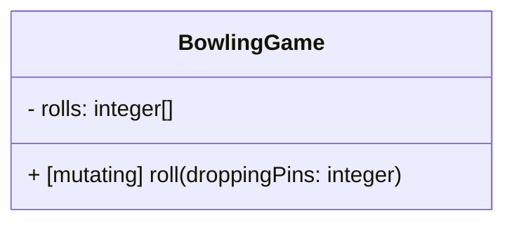
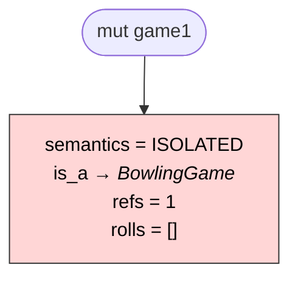
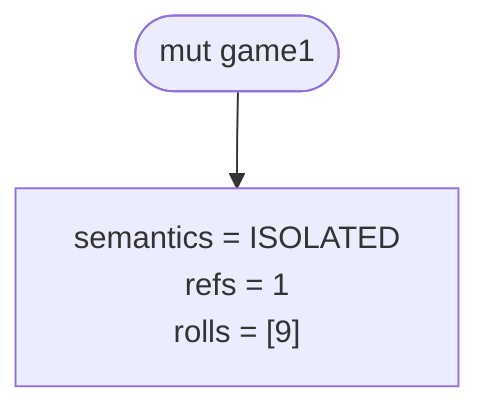
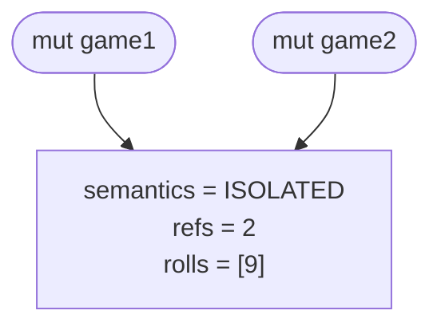
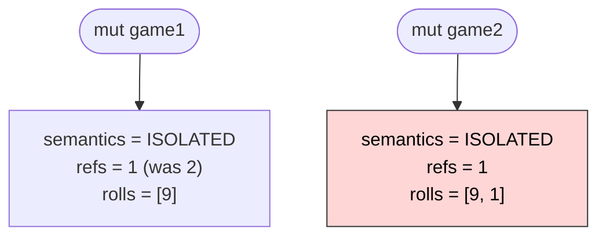
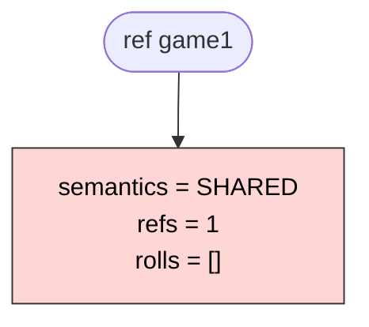
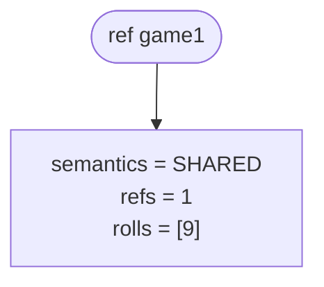
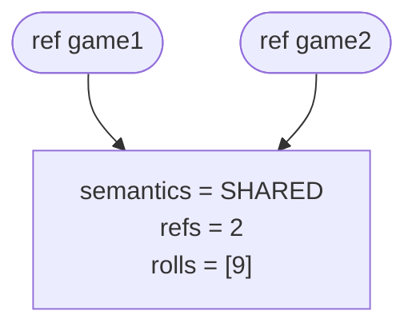
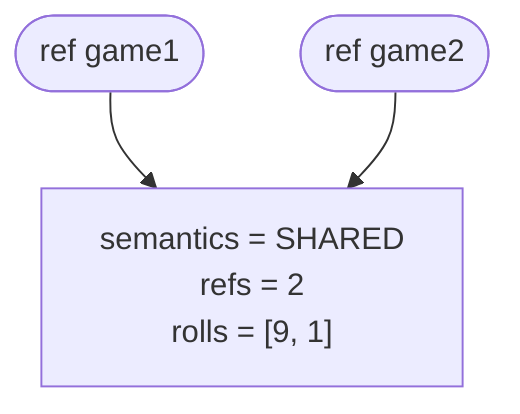

# Variable Scope & Semantics

> What if you want the same type in different parts of your code, but sometimes you need it to be a `struct` and at other times a `class`?

This is the thought that sparked the need for a new programming language.

In the languages I know, such a need would requires duplicating code—which violates DRY—or wrapping one type inside another—a `class` that contains a `struct`—which is awkward.

In Clawr, I want to be able to define a type once and then specify its "kind" (i.e., `struct`-like vs `class`-like) based on the context in which it is used. This would allow for more flexible and reusable code without duplication.

## The Problem: Shared Mutable State

“What is the difference between a `struct` and a `class`,” I hear you ask? Well, in programming, there is a big problem called _shared mutable state_.

Shared mutable state occurs when multiple parts of a program can access and modify the same data. This can lead to unexpected behaviour and bugs, it makes reasoning about code more difficult, and it adds complex synchronisation requirements in parallel execution.

It is caused by assigning one variable to another (`x = y`). Here are some concrete situations that can lead to shared mutable state:

- A variable is assigned to a field of an object or data structure
- A variable is passed as an argument to a function
- A field is returned from a function
- Multiple threads are started with access to the same variable
- A variable is captured in a closure
- A variable is stored in a global context
- A variable is stored in a collection that is shared across different parts of the program
- etc

### How Languages Address This

Different programming languages take different approaches:

- **Functional languages** (Haskell, Clojure): Disallow mutation altogether
- **Modern system languages** (Rust): Use ownership and borrowing systems
- **Hybrid languages** (C#, Swift): Introduce types with isolated mutation
  - `struct`: Value semantics (copied, isolated)
  - `class`: Reference semantics (shared, mutable state)

The problem with the hybrid approach: Programmers get confused when mixing `struct` and `class` (see below). And the mix is hidden from view.

Another problem is that you must decide at type definition whether it will be a `struct` or `class`, limiting reusability.

The problem with ownership and borrowing is that it can be confusing. While Rust's ownership system prevents entire classes of bugs, it comes at a cost: programmers must explicitly manage lifetimes and borrowing relationships through complex syntax. This shifts cognitive effort from domain problems to memory management details, making the code's intent less immediately clear.

### Stack vs. Heap

Most “Getting Started” tutorials for languages describe something like the following:

```swift
let a = SomeValue() // struct
let b = a
a.property = newValue()
print(b.property) // the old value

let a = SomeObject() // class
let b = a
a.property = newValue()
print(b.property) // the new value

So far all is good, but then comes the analogy:

let a = 2
let b = a
a += 5
print(b) // 2
```

They want to argue that assigning a new value to `a` is equivalent to changing a property of `a` . This apparently explains the expectation that any change to a value-type should not affect other variables. This is where they go wrong.

Of course, all languages are designed in such a way. Changing a property of a should not propagate to `b` if they are value-type variables. This is something so ingrained in us that we get confused by the following:

```swift
let a = struct.of { x: 5, y: anImage } // the type of y is a class
let b = a
a.x = 32
a.y.transform()
print(b.x) // 5 - not changed because x is a property of a struct
print(b.y) // b.y will be transformed too, because the image is a referenced object
          // but what do we expect?
```

Some programmers might expect all parts of the struct to be independently modifiable. In other words, they don’t expect `b.y` to be transformed. Others might say that this struct is not a value-type because it has properties that are class types.

The truth is that structs and classes both create objects. The difference is not in the objects, but in the variables they are assigned to. When you assign a struct object to a variable, that variable can only point directly at the object, so its entire data content has to be copied to the variable’s location. A class variable is a container for a pointer. Instead of copying the data representing the object, you copy the location of it. That’s why you

## Clawr’s Paradigm

Here is a proposal for Clawr. Instead of defining semantics per type, let’s make each variable individually declare its isolation level.

Rust uses ownership and borrowing to manage memory safety. While this is powerful, it requires explicit lifetime annotations that add syntactic overhead. With the proposed strategy, we can provide similar safety guarantees with clearer, more readable code.

| Keyword | Mutability | Semantics              | Use Case             |
| ------- | ---------- | ---------------------- | -------------------- |
| `const` | Immutable  | Isolated/Copy on Write | Constants, pure data |
| `mut`   | Mutable    | Isolated/Copy on Write | Isolated mutation    |
| `ref`   | Mutable    | Shared Reference       | Shared state         |

Mental Model:

- `const` variable: A constant value (even if structurally complex)
- `mut` variable: A container for data. The data can be copied to another container, but the containers remain independent.
- `ref` variable: A pointer to an entity. Multiple variables can reference and modify the same entity.

> [!note]
> We might want to consider additional keywords. For example, we might want to disallow structural mutation on `ref` variables (i.e., only allow calling mutating methods, but not changing fields directly). This would enforce better encapsulation. (Though a `let` copy might be sufficient in that case.)

With this approach, types can be defined without inherent semantics.

Let's explore an example to see why this flexibility is powerful. Consider a bowling game score calculator that needs to track rolls:

```clawr
type RollResult = integer @range(0..<10)

object BowlingGame {

    score() -> integer {
        // Calculate total score
        // See the Bowling Game Kata (http://www.butunclebob.com/ArticleS.UncleBob.TheBowlingGameKata) for an example algorithm.
    }

mutating:
    func roll(droppingPins count: RollResult) {
        rolls.append(count)
    }

data:
    rolls: [integer RollResult]
}
```

> [!note]
> This `BowlingGame` type is defined as an `object`, meaning it hides its data structure behind an encapsulation. This will be discussed in a [different document](../types/object-data.md).

Now, when using `BowlingGame`, we can choose the appropriate semantics based on our needs:

### Copy Semantics with `mut`

When using `mut` variables, changes are isolated:

```clawr
mut game1 = BowlingGame()
game1.roll(droppingPins: 9)
print(game1.score) // 9

mut game2 = game1                    // Shares memory (temporarily)
game2.roll(droppingPins: 1)          // Triggers copy-on-write
print(game1.score) // 9  ← unchanged
print(game2.score) // 10 ← includes second roll
```

### What happened?

1. `game1` and `game2` initially reference the same memory
2. When `game2.roll()` is called (a mutating method), the runtime detects multiple references
3. A copy is made before modification, ensuring `game1` remains unchanged
4. Each variable now has its own independent game state

### Reference Semantics with `ref`

When using `ref` variables, changes are shared:

```clawr
ref game1 = BowlingGame()
game1.roll(droppingPins: 9)
print(game1.score) // 9

ref game2 = game1                    // Shares the same game
game2.roll(droppingPins: 1)          // Modifies shared state
print(game1.score) // 10 ← changed!
print(game2.score) // 10 ← same game
```

### What happened?

1. Both variables reference the same game entity
2. Modifications through either variable affect the shared state
3. No copying occurs—this is true reference semantics

### When to Use Each

```clawr
// Local calculations - use mut for isolation
mut tempScore = game.calculateFrame(3)
tempScore.adjust(bonus: 10)  // Only affects tempScore

// Shared game state - use ref for coordination
ref activeGame = gameManager.currentGame
player1Thread.update(activeGame)
player2Thread.update(activeGame)  // Single game instance

// Immutable snapshots - use let for safety
let finalScore = game.score
archiveToDatabase(finalScore)  // Safe to share
```

## Notes on Implementation

### Memory Structure

To enforce isolation semantics, the runtime will need to manage memory with metadata indicating whether a memory block is `ISOLATED` or `SHARED`.

- **Semantics flag**: `ISOLATED` (for `let`/`mut` variables) or `SHARED` (for `ref` variables)
- **Reference Counter**: To track how many variables reference each memory block
- **Type Information**: To enable polymorphic behaviour and method dispatch, and to support runtime type-checking if needed

### Copy-on-Write Optimisation

The implementation should use automatic reference counting (ARC) with copy-on-write:

1. No copying at assignment: When x = y, both variables initially reference the same memory
2. Copy only when needed: A copy is made only when a mutating operation is about to be performed and…
   - Memory is flagged ISOLATED, AND
   - Reference count > 1
3. Never copy SHARED memory: This would violate the shared-state contract

This provides the safety of value semantics with the performance of reference semantics.

### Type Safety Rules

The compiler enforces the following rules:

- Cannot assign `ref` to `mut` or `let` without explicit copy:

  ```clawr
  ref r = BowlingGame()
  mut m = r              // Compile error
  mut m = r.copy()       // Explicit copy - OK
  ```

- Cannot assign `mut`/`let` to `ref` (would create isolated entity when shared expected):

  ```clawr
  mut m = BowlingGame()
  ref r = m              // Compile error
  ref r = m.copy()       // Explicit copy - OK
  ```

Different semantics cannot be mixed without explicit intent. There is no way to maintain two different sets of semantic guarantees for the same memory block. Therefore, a copy with different semantics must be created immediately at assignment. If this is done implicitly, it can lead to confusion and bugs.

### Function Parameters and Return Values

Function parameters and return values should also respect semantics:

- Parameters default to `let` semantics (isolated). Passing a `ref` requires explicit copy.
- Each function can specify if it returns `ref` or `let`/`mut` semantics.

Idea/exploration: What if parameters had their own semantics? They could be something like:

1. require immutable, isolated values; does not mutate or share state and reqiures that no other thread can change it while it’s working.
2. allow reference, but promise not to mutate: safe to pass `let` or `ref` variables without copying.
3. explicitly mutates received structure: requires `ref` variables; allows mutation of shared state.
4. temporarily borrows value for mutation: accepts `mut` or `ref` variables; might be dangerous to allow if the value can “escape.”
5. and other options?

## Proof of Concept

There is a [proof of concept repository](https://github.com/clawrlang/clawr-poc) that implements a compiler and runtime for Clawr, demonstrating the variable scope and semantics model described above. Its main focus is showing how the runtime can manage memory with the proposed semantics while providing safety guarantees.

It also implements the other big language idea of Clawr: enforcing [encapsulation vs pure data segregation](../types/object-data.md).

---

---

# Function Parameter Semantics

## Parameter Semantics Rules

Note: `mut` does not mean move ownership as `&mut` in Rust. Instead it means that value semantics (copy-on-write) applies to the variable.

Parameters have one extra semantics mode that ordinary variables cannot use:

- (default): Read-only access
  - Accepts: any variables regardless semantics
  - No copy created
  - Cannot be modified by the function
  - Could be modified by other thread if parallel execution is enabled
- **`const`**: Immutable isolated access
  - Semantically similar to the default, but cannot be affected by parallel mutation
  - Accepts: `const` or `mut` variables (and unassigned return values) but not `ref`
  - No copy created
  - Cannot be modified by the function
  - Value is immutable within function scope
- **`mut`**: Mutable isolated access
  - Semantically equivalent to `const`, but allows mutation in the function body
    - Accepts: `const` or `mut` variables (and unassigned return values) but not `ref`
    - Copies if mutating and high ref-count (CoW)
    - Reference count incremented on call
    - Value is mutable within function scope
    - Changes not visible to caller (isolated)
- **`ref`**: Shared mutable access
  - Accepts: `ref` variables only
  - Shares reference (increments refs)
  - Value is mutable within function scope
  - Modifications visible to all references (shared)

### Tension

Not sure if the signature should only allow `const` and not `mut`. Maybe the developer should be allowed to shadow the variable instead:

```clawr
func foo(label varName: const Type) {
  mut varName = varName // Makes varName mutable but does not increment refcount
  // Now varName can be mutated
  varName.modify()
}
```

Or maybe `const` and `mut` are interchangeable?

```clawr
trait SomeTrait {
  func foo(label varName: const Type)
}

object SomeObject: SomeTrait {
  // This works as implementation of the trait requirement
  func foo(label varName: mut Type) {
    varName.modify()
    // ...
  }
}

object IncorrectObject: SomeTrait {
  // This does not match the trait requirement (wrong semantics)
  func foo(label varName: ref Type) {
    varName.modify()
    // ...
  }
}
```

## Examples

### Example 1: `mut` parameter with COW

```clawr
func transform(value: mut Data) -> const Data {
  value.modify()  // Triggers COW if refs > 1
  return value
}

mut original = Data.new()
const result = transform(original)
// original unchanged (was copied on write inside transform)
// result contains the modified version
```

**What happens:**

1. `original` created from factory (`refs` = 1)
2. `original` passed to function and assigned to `value` (`refs` = 2)
3. `value.modify()` triggers COW (`refs` > 1, so copy happens)
4. `original.refs` is decremented to 1, `value` is pointed to new memory with `refs` = 1
5. `result` is assigned the modified copy (moved—`refs` stays as 1)
6. `original` is unchanged

### Example 2: `mut` parameter without copy

```clawr
func transform(value: mut Data) -> const Data {
  value.modify()  // Triggers COW if refs > 1
  return value
}

const result = transform(Data.new())
// No copy needed - Data.new() was unique (refs == 1)
```

**What happens:**

1. `Data.new()` creates unique value (`refs` = 1)
2. Passed to function (moved—`refs` stays 1)
3. `value.modify()` works directly on the value (refs == 1, no copy)
4. Returns the modified value
5. Efficient - zero copies

### Example 3: `const` parameter

```clawr
func analyze(data: const Data) -> Report {
  // Cannot modify data
  return Report.from(data)
}

mut myData = Data.new()
const report = analyze(myData)
// myData still accessible and unchanged
```

**What happens:**

1. `myData` created from factory (`refs` = 1)
2. `myData` passed to function (`refs` stays 1 as COW cannot occur)
3. Function has immutable view (compiler prevents modification)
4. No copy occurs (just reference sharing)

### Example 4: `in` parameter (default)

```clawr
func size(data: Data) -> Int {  // Implicit: data: in Data
  return data.count()
}

mut data1 = Data.new()
ref data2 = Data.new()
const data3 = Data.new()

size(data1)  // OK
size(data2)  // OK
size(data3)  // OK
// All share reference temporarily, no copies
```

**What happens:**

1. All variables created with `refs` = 1
2. Passed to function (`refs` stays 1 as COW cannot occur)
3. Function has immutable view (compiler prevents modification)
4. No copy occurs (just reference sharing)

## The Key Insight: COW Handles Everything

**Copy-on-write makes all of this work seamlessly**:

1. Parameters increment reference counts (cheap)
2. Read-only operations never trigger copies
3. Mutations trigger COW only when `refs` > 1
4. `mut` and `const` differ only in compile-time mutation permission
5. `ref` is the only one with shared mutation semantics

## Return Type Interaction

```clawr
func process(data: mut Data) -> const Data {
  data.modify()
  return data  // Returns ISOLATED (cannot prove unique)
}

func create() -> Data {
  return Data.new()  // Returns unique
}

// Usage:
ref r1 = create()      // OK: unique can become SHARED
ref r2 = process(...)  // Error: ISOLATED needs copy

mut m1 = create()      // OK: unique can become ISOLATED
mut m2 = process(...)  // OK: ISOLATED → ISOLATED
```

## Complete Syntax Proposal

```clawr
func example(
    param1: Data,              // Implicit: in Data (read-only, any variable)
    param2: in Data,           // Explicit: read-only, any variable
    param3: const Data,        // Immutable isolated (const/mut variables)
    param4: mut Data,          // Mutable isolated (const/mut variables, COW)
    param5: ref Data           // Shared mutable (ref variables only)
) -> const Result {            // Returns ISOLATED
  // Function body
}

func factory() -> Widget {     // Returns unique (refs == 1 proven)
  return Widget.new()
}

func getter(obj: ref Container) -> ref Widget {  // Returns SHARED
  return obj.widget
}
```

---

---

# Variable Semantics for Function Return Values

Functions can return memory they just allocated, memory that they receive from somewhere else, or memory stored as a field. That memory could have `ISOLATED` or `SHARED` semantics. But functions should be reusable whether the caller assigns the result to a `const` or a `ref` variable. To resolve this, Clawr uses _uniquely referenced values_ where possible.

## Uniquely Referenced Values

Functions return “uniquely referenced” values by default. A uniquely referenced value is an `ISOLATED` memory block that has a reference count of exactly one. It is assumed that the value will be assigned to a variable, which is is already counted. If it is not, it must be released (and deallocated) by the caller.

A uniquely referenced value can be reassigned new semantics. If the caller assigns the value to a `const` or `mut` variable, the memory is awarded `ISOLATED` semantics. If it is assigned to a `ref` variable, it is given `SHARED` semantics. Once the value has been assigned, the semantics is locked until it is deallocated (unless it is returned again as a uniquely referenced value).

Uniquely referenced values will always be `ISOLATED`. This is a consequence of the fact that `SHARED` values will always have multiple references. If, for example, you return the value of a `ref` field, that field will hold one reference, and for the caller to be able to hold a reference, the count must be at least two.

## Uniquely Referenced Return Values are _Moved_

Reference-counted values will be deallocated as soon as the counter reaches zero. Therefore, it is impossible for the called function to count down _all_ its references and then return the value. It must leave a reference count of one (even though it technically holds zero references). That means that the caller must adjust _its_ behaviour accordingly. It just takes over the reference without counting up. If it does not store the value (for example if it just passes it to another function, or uses it for computation etc) it must call `releaseRC()` so that the memory does not leak.

When a function returns an `ISOLATED` value, that memory is “moved.” That means that if the function does `return x` it will not call `releaseRC(x)` (but it will call `releaseRC()` for all other variables in its scope). The receiving variable will not call `retainRC()` on the returned value, but will just take over the reference from the called function.

In other words, returned values must have a reference count of exactly one. We call this a “unique reference.” If it is unclear at compile-time, whether the memory could have multiple references, the compiler could inject a `mutateRC()` call. This function creates a copy of the memory if it has a high reference count, and always returns a memory block with a reference count of one.

Alternatively, we could make the return type `const Value`, meaning that the value har explicit `ISOLATED` semantics and can only be assigned to a `const` or `mut` variable.

## Semantics Rules

1. `ISOLATED` memory may not be assigned to `ref` variables. Explicit `copy()` is required.
2. `SHARED` memory may not be assigned to `const` / `mut` variables. Explicit `copy()` is required.
3. `SHARED` memory returned from a function modifies its return type, `-> ref Value`.
4. `ISOLATED` memory (returned from a function) can be reassigned `SHARED` if `refs == 1`.
5. `ISOLATED` memory with a (possible) high ref count makes the return type `const Value`.
6. If a function cannot prove that the value is always uniquely referenced, it must announce that its semantics are fixed.
7. The compile could inject `mutateRC(returnValue)` to ensure that it is uniquely referenced. Thought this might mean unnecessary copying.

```clawr
func returnsRef() -> ref Student // SHARED memory
func returnsCOW() -> const Student // ISOLATED memory with multiple refs
func returnsUnique() -> Student  // uniquely referenced, reassignable
```

## Constructors

Clawr does not have constructors like other OO languages, but does have `data` literals and factory functions.

A factory is just a free function (probably in a namespace with the same name as the type) that creates an `ISOLATED`, uniquely referenced, memory block. This is then assigned as needed to a `ref`, `mut` or `const` variable according to the rules above.

---

---

# Variable Semantics Example

There are two kinds of memory structures in Clawr: `ISOLATED` and `SHARED`.

When a variable is declared as `const` or `mut`, the corresponding data structure will be flagged as the `ISOLATED` variety. This means that if there are multiple references to that structure when it is edited, the editing must be performed on a copy of the structure, not the structure itself. Only the variable that is explicitly edited may be modified. No other variables that reference the original structure may be changed. Local reasoning is a really powerful concept for understanding the state of your program. That is the contract when using `const` and `mut`.

When using `ref`, the contract says that the main subject is the referenced object (the structure in memory), not the variable. A variable is but one of potentially myriad pointers _referencing_ this object. Modifying the object from one location, should instantly be reflected to all other references. Using `ref` can improve performance—as no (implicit) copying is performed—but it invalidates local reasoning. And it also adds complexity in parallel execution contexts; you will need locking or other mechanisms to ensure that two processes cannot modify the same information at the same time.

To illustrate the difference between copy and reference semantics, let’s consider a Bowling game score calculator as an example. The actual code to calculate the score is irrelevant here, but we can assume that it needs to log how many pins were knocked down (or “dropped”) by each roll of the bowling ball. Let’s imagine an encapsulated `BowlingGame` `object` type that calculates the score for a single player:



## Copy Semantics

Let’s start playing a game using a `mut` variable, and then assign the game to a different variable that we’ll continue the game through. Because we’re using `mut` variables, this will create two isolated games.

```clawr
mut game1 = BowlingGame() // Creates a new `ISOLATED` memory structure
game1.roll(droppingPins: 9)
print(game1.score) // 9

mut game2 = game1 // Temporarily references the same memory block
game2.roll(droppingPins: 1) // Mutating game2 implicitly creates a copy where the change is applied
print(game1.score) // 9 - the game1 variable has not been changed by the last roll
print(game2.score) // 10 - game2 includes the score for the second roll
```

Let’s follow the state of the memory for each line of code in the example. First a `BowlingGame` object is instantiated and assigned to the `game1` variable. We can illustrate that as follows:

```clawr
mut game1 = BowlingGame()
```



The memory holds the state of the game as defined by the `BowlingGame` object type. It also holds some data defined implicitly by the Clawr compiler. These include a `semantics` flag, an `is_a` pointer that identifies the object's type, and a reference counter (`refs`).

The `is_a` pointer is irrelevant to memory management and will be elided in the other charts on this page. It identifies the type of the object and can be used for runtime type checking. The assigned type defines the layout of the memory block. It is also used for polymorphism (looking up which function to execute for a given method call).

The `semantics` flag identifies the memory structure as belonging to a `mut` variable and hence requiring isolation, the behaviour expressed in this exchange.

The `refs` counter starts at one at allocation and is incremented with every new variable assignment. When a variable is reassigned or descoped, the counter is decremented so that it always counts exactly how many references the structure has. When the counter reaches zero the memory is released to the system for other uses.

For a local variable in a function, reference counting might be redundant, as the memory will certainly be reclaimed when the function returns. But the structure can also be referenced by another structure, and will then have to be kept around for as long as that structure maintains _its_ reference.

The second line logs a roll of the bowling ball, which knocks down 9 pins. Because the `refs` counter is 1, this change is written directly into the memory without creating a copy.

```clawr
game1.roll(droppingPins: 9)
```



Then the new variable `game2` is assigned to the structure.

```clawr
mut game2 = game1
```



This increments the `refs` counter as there are now two variables referencing the same structure. As long as no modification is made to the structure, there is no need to maintain isolation. Both variables can reference the same memory block.

But then `game2` is modified though the `game2.roll(droppingPins: 1)` call, The method is tagged as `mutating`, which indicates that calling it will cause changes to the memory. As the `ISOLATED` flag indicates that memory changes must be done in isolation, a copy is made, and then the method is invoked _on that copy_.

```clawr
game2.roll(droppingPins: 1) // mutating method call
```



In the image, the red background signals a newly claimed block of memory. The other block is the original, unchanged one.

The new block will only be referenced by the changing variable (`game2`) and receives a `refs` counter of 1. Because `game2` has been reassigned, the old structure’s `refs` counter is decremented by one.

And this is how we can play two isolated bowling games even though we only explicitly created one.

## Reference Semantics

When a structure is instantiated and assigned to a `ref` variable, on the other hand, it will be flagged as `SHARED`. This means that multiple `ref` variables may reference the same (shared) structure and no implicit copying will be made.

Here is an example of usage:

```clawr
ref game1 = BowlingGame() // Creates a new `SHARED` memory structure
game.roll(droppingPins: 9)
print(game1.score) // 9

ref game2 = game // References the same structure
game2.roll(droppingPins: 1) // Mutation does not cause a copy
print(game1.score) // 10
```

Let’s follow the state of the memory for each line of code in the example. First a `BowlingGame` object is instantiated and assigned to the `game1` variable. We can illustrate that as follows:



The memory is structured exactly the same way as for a `ISOLATED` variable and the `is_a` (elided here) and `refs` properties have the same purposes. The only difference is the value of the `semantics` flag. In this case we use `SHARED` which has implications when we assign this block to multiple variables.

The second line logs a roll of the bowling ball, which knocks down 9 pins:



When the other variable is assigned:



And when the next roll is logged it updates the shared memory, affecting both variables:



This did not trigger a copy in this case. Because the variables are `ref`—and the memory is flagged as `SHARED`—the contract is different than that of `mut` variables.

A `mut` variable has to be isolated: it must not be changed by changing other variables, and no other variables may change when _it_ is changed. This is a powerful guarantee that makes local reasoning possible.

But the `ref` contract requires that a single entity can be referenced (and modified) from multiple locations. It must _not_ be copied (unless explicitly requested to) or the contract is broken.
